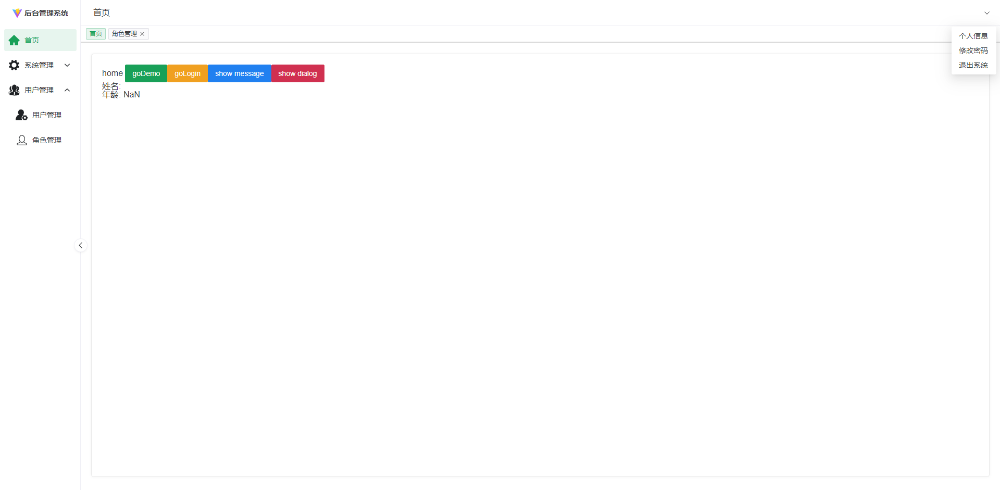

# Vue3-Vite-Pinia-Naive-Js

## 前言

本系统，默认静态数据，包括登录，路由等。可在代码里自助切换成接口登录，接口获取动态路由。
在vite.config.js里根据自身接口映射地址填写。

## 开发须知

本系统基于Vue3-Vite-Js-Pinia开发，扩展性极强（就是除了基础的功能，啥都木有，自己根据需求写，直接删掉了不需要的代码，也就是木写，免得你还需要自己删）

后续还有补充的慢慢来吧

## 搭建教程

[Vue3+Vite+Pinia+Naive后台管理系统搭建之一：基础项目构建](https://blog.csdn.net/weixin_64684095/article/details/129850926?spm=1001.2014.3001.5501)

[Vue3+Vite+Pinia+Naive后台管理系统搭建之二：scss 的安装和使用](https://blog.csdn.net/weixin_64684095/article/details/131600947?csdn_share_tail=%7B%22type%22%3A%22blog%22%2C%22rType%22%3A%22article%22%2C%22rId%22%3A%22131600947%22%2C%22source%22%3A%22weixin_64684095%22%7D)

[Vue3+Vite+Pinia+Naive后台管理系统搭建之三：vue-router 的安装和使用](https://blog.csdn.net/weixin_64684095/article/details/131634045?csdn_share_tail=%7B%22type%22%3A%22blog%22%2C%22rType%22%3A%22article%22%2C%22rId%22%3A%22131634045%22%2C%22source%22%3A%22weixin_64684095%22%7D)

[Vue3+Vite+Pinia+Naive后台管理系统搭建之四：Naive UI 组件库的安装和使用](https://blog.csdn.net/weixin_64684095/article/details/131644674?csdn_share_tail=%7B%22type%22%3A%22blog%22%2C%22rType%22%3A%22article%22%2C%22rId%22%3A%22131644674%22%2C%22source%22%3A%22weixin_64684095%22%7D)

[Vue3+Vite+Pinia+Naive后台管理系统搭建之五：Pinia 状态管理](https://blog.csdn.net/weixin_64684095/article/details/131655957?csdn_share_tail=%7B%22type%22%3A%22blog%22%2C%22rType%22%3A%22article%22%2C%22rId%22%3A%22131655957%22%2C%22source%22%3A%22weixin_64684095%22%7D)

[Vue3+Vite+Pinia+Naive后台管理系统搭建之六：Axios 网络请求](https://blog.csdn.net/weixin_64684095/article/details/131664649?csdn_share_tail=%7B%22type%22%3A%22blog%22%2C%22rType%22%3A%22article%22%2C%22rId%22%3A%22131664649%22%2C%22source%22%3A%22weixin_64684095%22%7D)

[Vue3+Vite+Pinia+Naive后台管理系统搭建之七：utils 工具构建](https://blog.csdn.net/weixin_64684095/article/details/131685112?csdn_share_tail=%7B%22type%22%3A%22blog%22%2C%22rType%22%3A%22article%22%2C%22rId%22%3A%22131685112%22%2C%22source%22%3A%22weixin_64684095%22%7D)

[Vue3+Vite+Pinia+Naive后台管理系统搭建之八：构建 login.vue 登录页](https://blog.csdn.net/weixin_64684095/article/details/131725136?csdn_share_tail=%7B%22type%22%3A%22blog%22%2C%22rType%22%3A%22article%22%2C%22rId%22%3A%22131725136%22%2C%22source%22%3A%22weixin_64684095%22%7D)

[Vue3+Vite+Pinia+Naive后台管理系统搭建之九：layout 动态路由布局](https://blog.csdn.net/weixin_64684095/article/details/132149558?csdn_share_tail=%7B%22type%22%3A%22blog%22%2C%22rType%22%3A%22article%22%2C%22rId%22%3A%22132149558%22%2C%22source%22%3A%22weixin_64684095%22%7D)

## 效果图

